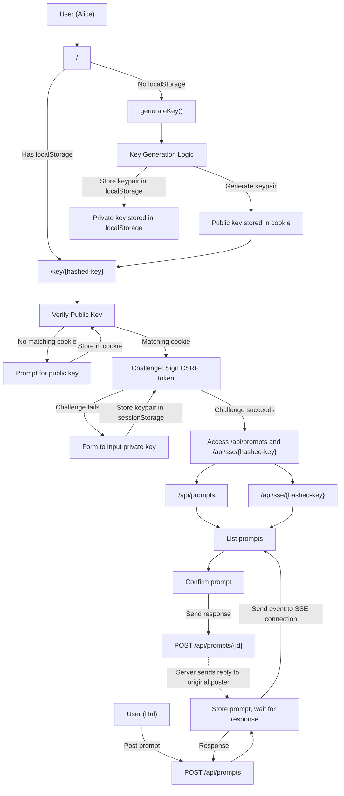

# Prompt Service

## **What is Prompt Service?**

Prompt Service is a secure way to send and receive interactive prompts through a web interface. Instead of relying on a browser (`window.prompt`) or a repl (`input`), it provides a universal, real-time interface for prompt interactions.

### **Why Choose Prompt Service?**

- **🔒 Secure**: Uses advanced cryptography to ensure only you can respond to your prompts
- **⚡ Real-time**: Get instant notifications when new prompts arrive
- **🌐 Web-based**: Access from any modern web browser

### **How It Works**

1. **Get Started**: Visit the service and generate a secure keypair
2. **Receive Prompts**: Connect to receive prompts in real-time
3. **Send Prompts**: Programmatically send prompts to the key via API
4. **Respond**: Answer prompts through a clean web interface

### **Quick Start**

Ready to try it? Here's how to get started in minutes:

1. Open your web browser and navigate to the Prompt Service URL
2. Click "Generate New Key" to create your secure identity
3. Prompts can be sent using `curl localhost/api/prompts -X POST -d '{"public_key": "xY...A0=", "message": "Can you see this?"}'`
4. Start receiving and responding to prompts immediately!

---
## **Building and Testing**

### **Common Go Commands**
```bash
# Build the application
go build

# Run the application
go run main.go

# Run all tests
go test ./...

# Run tests with verbose output
go test -v ./...

# Run tests with coverage
go test -cover ./...

# Format code
go fmt ./...

# Vet code for potential issues
go vet ./...

# Tidy up dependencies
go mod tidy

# Download dependencies
go mod download
```
---
## **Nix/NixOS Deployment**

This project includes Nix support for reproducible builds and secure service deployment. Static files (HTML, CSS, JS) are embedded directly into the binary for improved security and portability.

### **Prerequisites**
- Nix package manager
- NixOS (for service deployment)

### **Development with Nix**
```bash
# Enter development shell
nix-shell

# Build the application
nix-build

# Run the application
./result/bin/prompt-service-server
```

### **NixOS Service Deployment**

The project provides a NixOS module for running the service as a systemd service with hardened security settings.

1. **Add to your NixOS configuration**:
```nix
{ config, lib, pkgs, ... }:

let
  # Import the prompt-service-server package and module
  promptService = import /path/to/prompt-service-server/default.nix { inherit pkgs; };
  promptServiceModule = import /path/to/prompt-service-server/nixos-module.nix;
in
{
  # Import the prompt-service-server module
  imports = [ promptServiceModule ];

  # Enable and configure the service
  services.prompt-service-server = {
    enable = true;
    port = 3000;
    csrfTokenSecret = "your-csrf-secret";     # Use a secure random key
  };

  # Open firewall port
  networking.firewall.allowedTCPPorts = [ 3000 ];
}
```

2. **Security Features**:
   - Runs as dedicated system user (`prompt-service`)
   - Private temporary directories
   - No new privileges
   - Strict system protection
   - Memory write protection
   - Restricted namespaces and address families
   - **Static files embedded in binary** - no filesystem access needed for web assets
   - Limited file descriptors

3. **Rebuild and deploy**:
```bash
sudo nixos-rebuild switch
```

### **Manual Service Management**
```bash
# Check service status
sudo systemctl status prompt-service-server

# View logs
sudo journalctl -u prompt-service-server -f

# Restart service
sudo systemctl restart prompt-service-server
```
---
## **Core Requirements**
### **1. Key Management**
- **Key Generation**:
  - A javascript function generates a new ed25519 keypair (public/private).
  - The public key is stored in a cookie.
  - The whole keypair should be stored in `localStorage`.
  - The user should be redirected to `/key/{sha-256-hashed-public-key}`.
- **Key Verification**:
  - A GET request to `/key/{string}` without a matching public key in a cookie results in a redirect to `/`.
  - A GET request to `/key/{string}` where the public key in a cookie hashed to the path argument `{string}`, returns a CSRF response header and a page.
  - The page will use javascript to sign the CSRF token using a private key.
  - If the private key is missing, the user is shown a form to input a private key.
  - The signed token is used as Authorization header to request `/api/prompts` and `/api/sse/{sha-256-hashed-public-key}`.
- **Key Storage**:
  - The private key is stored in `localStorage` (persistent across sessions).
### **2. Prompt Handling**
- **Posting Prompts**:
  - A POST request to `/api/prompts` must include:
    - A public key (to specify which user should respond).
    - A message (the prompt content).
  - The server keeps the connection and prompt in memory and waits for the associated public key to respond.
  - When a prompt is posted, the server sends an event to the corresponding SSE (Server-Sent Events) connection.
- **Receiving Prompts**:
  - Users with a valid key establish an SSE connection to `/api/sse/{hashed-public-key}`.
  - Users can view open prompts at `/api/prompts` and respond to them via a dedicated interface.
### **3. Authentication**
- **Cookie-Based Authentication**:
  - **Public Key Cookie**: The public key is stored in a `publicKey` cookie (base64 encoded).
  - **CSRF Token Cookie**: A JWT token is generated server-side and stored in a `CSRFToken` cookie.
  - **Signature Cookie**: The client signs the CSRF token with their private key and stores the signature in a `CSRFChallenge` cookie (base64 encoded).
- **Asymmetric Key Authentication**:
  - **Prompt POST**:
    - Requires the public key of the expected responder in the request body.
  - **Prompts GET**:
    - Requires valid `publicKey`, `CSRFToken`, and `CSRFChallenge` cookies.
    - The server verifies the signature against the public key.
  - **SSE Connection**:
    - Requires valid cookies for authentication.
- **CSRF Token Mechanism**:  
  - The CSRF token is a **JWT (JSON Web Token)** signed by the server with a server-side secret key.  
  - The JWT includes:  
    - A hash of the user's public key .  
    - An expiration timestamp (e.g., 5 minutes from issuance).  
  - The client receives the token via `/api/auth/{id}` and stores it in a cookie.  
  - The client signs the JWT with its private key and stores the signature in a cookie.  
  - The server validates:  
    1. The JWT's **server-side signature** (to ensure the token was issued by the server).  
    2. The **client's signature** of the JWT (to prove ownership of the private key).  
- **Client Behavior**:  
  - The client automatically fetches the CSRF token, signs it, and sets the signature cookie.  
  - Authentication is handled transparently in the background.  
- **Server Behavior**:  
  - The server generates the JWT with its own secret key and the user's public key hash.  
  - The server verifies the client's signature against the client's public key.  
  - The server checks the JWT's expiration.  
---
## **User Scenarios**
### **1. New User (Alice)**
- Visits `/` with no `localStorage` keys.
- Clicks "Generate New Key" button.
- Keypair is generated locally using JavaScript Ed25519 and stored in `localStorage`.
- Public key is set in a cookie.
- Automatically redirected to `/key/{hashed-public-key}`.
- Client automatically fetches CSRF token, signs it, establishes SSE connection, and loads prompts.

### **2. Returning User (Bob)**
- Visits `/` with keys in `localStorage`.
- Clicks on a key link or the system automatically detects the cookie.
- Redirected to `/key/{hashed-public-key}` with public key in cookie.
- Client automatically verifies the key matches stored keys, fetches and signs CSRF token, establishes SSE connection, and loads prompts.

### **3. Externally Keyed User (Charlie)**
- Visits `/`.
- Uses the import form to upload a pre-generated Ed25519 keypair.
- Private key is stored in `localStorage`.
- Public key is set in a cookie.
- Automatically redirected to `/key/{hashed-public-key}`.
- Client automatically fetches CSRF token, signs it, establishes SSE connection, and loads prompts.

### **4. Digital User (Hal)**
- Posts a prompt to `/api/prompts` with a public key.
- The user (Alice/Bob/Charlie) receives the prompt via automatic SSE updates.
- Responds via the prompt interface.
- The response is sent as plain text.
- The server sends a reply to Hal's original POST request.
---
## **Endpoints**
| Endpoint            | Method | Description |
|-----------------|---------|-------------|
| `/`                      | GET    | Serves the main application interface. |
| `/key/{id}`         | GET    | Verifies ownership of the public key and serves the prompt interface. |
| `/api/auth/{id}`   | GET    | Returns a CSRF token for authentication. |
| `/api/prompts`     | POST   | Posts a prompt for a specific public key. |
| `/api/prompts/{id}`| GET    | Returns a list of open prompts for the specified key hash. |
| `/api/prompts/{id}`| POST   | Submits a response to a specific prompt. |
| `/api/sse/{id}`    | GET    | Establishes an SSE connection for real-time prompt updates. |
---

```yml
openapi: 3.0.3
info:
  title: Prompt Service API
  description: A webserver acting as a prompt service with asymmetric cryptography authentication
  version: 1.0.0
servers:
  - url: https://prompt.sollisoft.com
    description: Production server
paths:
  /:
    get:
      summary: Show a list of keys or generate a new one
      description: Links to /key/{hash} for each key the user has stored
      responses:
        200:
          content:
            text/html:
              example: |
                <!DOCTYPE html>
                <html>
                  <head>
                    <title>Prompt Service</title>
                    <script src="/main.js"></script>
                  </head>
                  <body>
                    <button id="generateKey">Generate New Key</button>
                    <div id="keyList"></div>
                  </body>
                </html>
  /key/{hash}:
    get:
      summary: Verify public key ownership
      parameters:
        - name: hash
          in: path
          required: true
          description: SHA-256 hash of public key
          schema:
            type: string
      responses:
        200:
          description: Challenge to sign CSRF token (returns HTML with embedded JavaScript)
          headers:
            X-CSRF:
              schema:
                type: string
              description: CSRF token.
          content:
            text/html:
              example: |
                <!DOCTYPE html>
                <html>
                <head><title>Verify Key</title></head>
                <body>
                <script>
                  // Example JavaScript to fetch prompts and establish SSE connection
                  fetch('/api/prompts', {
                    headers: {
                      'Authorization': 'SIGNED_CSRF_HERE'
                    }
                  });
                  const eventSource = new EventSource(`/api/sse/${hash}`);
                  eventSource.onmessage = function(event) {
                    console.log('Received event:', event.data);
                  };
                </script>
                </body>
                </html>
        401:
          description: Public key not found in cookie
          content:
            application/json:
              schema:
                type: object
                properties:
  /api/auth/{hash}:
    get:
      summary: Get CSRF token for authentication
      parameters:
        - name: hash
          in: path
          required: true
          description: SHA-256 hash of public key
          schema:
            type: string
      responses:
        200:
          description: CSRF token returned and set as cookie
          headers:
            Set-Cookie:
              schema:
                type: string
              description: CSRFToken cookie containing JWT
          content:
            text/plain:
              schema:
                type: string
              example: "eyJhbGciOiJIUzI1NiIsInR5cCI6IkpXVCJ9..."
        400:
          description: Invalid public key cookie
  /api/prompts:
    post:
      summary: Post a prompt for a specific public key
      requestBody:
        required: true
        content:
          application/json:
            schema:
              type: object
              properties:
                public_key:
                  type: string
                  description: Base64 encoded public key of the expected responder
                message:
                  type: string
                  description: Prompt content
              required:
                - public_key
                - message
      responses:
        200:
          description: Prompt posted successfully
          content:
            plain/text:
              schema:
                type: string
                description: The prompt response
              example: "42"
        400:
          description: Invalid request body
          content:
            application/json:
              schema:
                type: object
                properties:
                  error:
                    type: string
                    example: "Invalid public key or message format"
        408:
          description: Request timeout
          content:
            plain/text:
              schema:
                type: string
                description: The prompt response
              example: "User did not confirm the prompt in time"
  /api/prompts/{hash}:
    get:
      summary: Return list of open prompts for the specified key hash
      parameters:
        - name: hash
          in: path
          required: true
          description: SHA-256 hash of public key
          schema:
            type: string
      responses:
        200:
          description: List of open prompts
          content:
            application/json:
              schema:
                type: array
                items:
                  type: object
                  properties:
                    id:
                      type: string
                      description: Unique prompt ID
                    message:
                      type: string
                    senderPublicKey:
                      type: string
                    issued:
                      type: string
              example:
                - id: "12345"
                  message: "What is the answer to life?"
                  senderPublicKey: "AQIDBA=="
                  issued: "2024-06-06T04:30:00.000Z"
        401:
          description: Authentication failed
    post:
      summary: Submit response to a specific prompt
      parameters:
        - name: hash
          in: path
          required: true
          description: SHA-256 hash of public key
          schema:
            type: string
      requestBody:
        required: true
        content:
          text/plain:
            schema:
              type: string
            description: The response text
      responses:
        200:
          description: Response submitted successfully
          content:
            text/plain:
              schema:
                type: string
              example: "12345"
        401:
          description: Authentication failed
  /api/sse/{hash}:
    get:
      summary: Establish SSE connection for real-time updates
      parameters:
        - name: hash
          in: path
          required: true
          description: SHA-256 hash of public key
          schema:
            type: string
      responses:
        200:
          description: SSE connection established
          content:
            text/event-stream:
              example: |
                data: {"type": "connected", "content": "Connection established"}
                data: {"type": "new_prompt", "content": "What is the answer to life?"}
                data: {"type": "prompt_responded", "content": "12345:42"}
        401:
          description: Authentication failed
```
