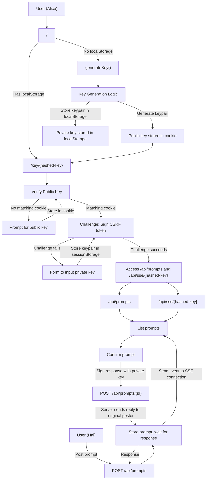

## **System Overview**
This webserver acts as a prompt service, enabling users to receive and respond to prompts without relying on `window.prompt`. It uses asymmetric cryptography for authentication and secure communication. The system supports three types of users: new users, returning users, and users with externally generated keys.
---
## **Core Requirements**
### **1. Key Management**
- **Key Generation**:
  - A javascript function generates a new ed25519 keypair (public/private).
  - The public key is stored in a cookie.
  - The whole keypair should be stored in `localStorage`.
  - The user should be redirected to `/key/{sha-256-hashed-public-key}`.
- **Key Verification**:
  - A GET request to `/key/{string}` without a matching public key in a cookie results in a redirect to `/`.
  - A GET request to `/key/{string}` where the public key in a cookie hashed to the path argument `{string}`, returns a CSRF response header and a page.
  - The page will use javascript to sign the CSRF token using a private key.
  - If the private key is missing, the user is shown a form to input a private key.
  - The signed token is used as Authorization header to request `/api/prompts` and `/api/sse/{sha-256-hashed-public-key}`.
- **Key Storage**:
  - The "Keep me logged in" checkbox determines whether the private key is stored in `localStorage` or `sessionStorage`.
### **2. Prompt Handling**
- **Posting Prompts**:
  - A POST request to `/api/prompts` must include:
    - A public key (to specify which user should respond).
    - A message (the prompt content).
  - The server keeps the connection and prompt in memory and waits for the associated public key to respond.
  - When a prompt is posted, the server sends an event to the corresponding SSE (Server-Sent Events) connection.
- **Receiving Prompts**:
  - Users with a valid key establish an SSE connection to `/api/sse/{hashed-public-key}`.
  - Users can view open prompts at `/api/prompts` and respond to them via a dedicated interface.
### **3. Authentication**
- **Asymmetric Key Authentication**:
  - **Prompt POST**:
    - Requires the public key of the expected responder.
  - **Response POST**:
    - Requires the public key and a digital signature of the response using the private key.
    - The server validates the signature against the public key.
  - **Prompts GET**:
    - Requires a digital signature of the CSRF token using the private key.
    - The server validates the signature against the public key.
  - **CSRF Token Mechanism**:  
    - The CSRF token is a **JWT (JSON Web Token)** signed by the server with a server-side secret key.  
    - The JWT includes:  
      - A unique identifier for the request.  
      - An expiration timestamp (e.g., 5 minutes from issuance).  
      - A hash of the user's public key (to associate the token with the user).  
    - The client receives the whole token to sign using the client's private key.  
    - The server validates:  
      1. The JWT's **server-side signature** (to ensure the token was issued by the server).  
      2. The **client's signature** of the JWT (to prove ownership of the private key).  
    - If both signatures are valid, the request is processed; otherwise, it is rejected.  
  - **Client Behavior**:  
    - The client does not need to know the JWT's internal structure.  
    - The client must sign the whole JWT with its private key and send it as part of the request.  
  - **Server Behavior**:  
    - The server generates the JWT with its own secret key.  
    - The server verifies the client's signature against the client's public key.  
    - The server checks the JWT's expiration and ensures the public key hash matches the user's public key.  
---
## **User Scenarios**
### **1. New User (Alice)**
- Visits `/` with no `localStorage`.
- Clicks new key button.
- Keypair is generated locally using javascript and stored in `localStorage`.
- Redirected to `/key/{hashed-public-key}` with public key in a cookie.
### **2. Returning User (Bob)**
- Visits `/` with a key in `localStorage`.
- Click on `/key/{hashed-public-key}` with public key in a cookie.
- Accesses `/api/prompts` and SSE connection.
- Automatically passes the challenge (since the private key is available).
### **3. Externally Keyed User (Charlie)**
- Visits `/`.
- Uploads a pre-generated keypair (via file or string inputs).
- Private key is not stored in `localStorage` (unless "Keep me logged in" is selected).
- Redirected to `/key/{hashed-public-key}` with public key in a cookie.
- Is asked to provide private key (to store in `sessionStorage` if not in `localStorage`).
- Accesses `/api/prompts` and SSE connection.
- Passes the challenge (since the private key is available in either `sessionStorage` or `localStorage`).
### **4. Digital User (Hal)**
- Posts a prompt to `/api/prompts` with a public key.
- The user (Alice/Bob/Charlie) receives the prompt via SSE.
- Responds via the `/api/prompts` interface.
- The response is signed and sent to the server.
- The server sends a reply to Hal's original post to `/api/prompts`.
---
## **Endpoints**
| Endpoint            | Method | Description |
|-----------------|---------|-------------|
| `/`                      | GET    | Redirects based on user state (new/returning/external). |
| `/key/{id}`         | GET    | Verifies ownership of the public key via challenge. |
| `/api/prompts`  | POST   | Posts a prompt for a specific public key. |
| `/api/prompts`  | GET    | return a list of open prompts for the user's public key. |
| `/api/sse/{id}`   | GET    | Establishes an SSE connection for real-time prompt updates. |
---

```yml
openapi: 3.0.3
info:
  title: Prompt Service API
  description: A webserver acting as a prompt service with asymmetric cryptography authentication
  version: 1.0.0
servers:
  - url: https://prompt.sollisoft.com
    description: Production server
paths:
  /:
    get:
      summary: Show a list of keys or generate a new one
      description: Links to /key/{hash} for each key the user has stored
      responses:
        200:
          content:
            text/html:
              example: |
                <!DOCTYPE html>
                <html>
                  <head>
                    <title>Prompt Service</title>
                    <script src="/main.js"></script>
                  </head>
                  <body>
                    <button id="generateKey">Generate New Key</button>
                    <div id="keyList"></div>
                  </body>
                </html>
  /key/{hash}:
    get:
      summary: Verify public key ownership
      parameters:
        - name: hash
          in: path
          required: true
          description: SHA-256 hash of public key
          schema:
            type: string
      responses:
        200:
          description: Challenge to sign CSRF token (returns HTML with embedded JavaScript)
          headers:
            X-CSRF:
              schema:
                type: string
              description: CSRF token.
          content:
            text/html:
              example: |
                <!DOCTYPE html>
                <html>
                <head><title>Verify Key</title></head>
                <body>
                <script>
                  // Example JavaScript to fetch prompts and establish SSE connection
                  fetch('/api/prompts', {
                    headers: {
                      'Authorization': 'SIGNED_CSRF_HERE'
                    }
                  });
                  const eventSource = new EventSource(`/api/sse/${hash}`);
                  eventSource.onmessage = function(event) {
                    console.log('Received event:', event.data);
                  };
                </script>
                </body>
                </html>
        401:
          description: Public key not found in cookie
          content:
            application/json:
              schema:
                type: object
                properties:
                  error:
                    type: string
                    example: "Public key not found in cookie. Please enter your public key."
  /api/prompts:
    get:
      summary: Return list of open prompts
      parameters:
        - name: Authorization
          in: header
          required: true
          description: Challenge signed by client's private key
          schema:
            type: string
      responses:
        200:
          description: List of open prompts
          content:
            application/json:
              schema:
                type: array
                items:
                  type: object
                  properties:
                    id:
                      type: string
                      description: Unique prompt ID
                    message:
                      type: string
                    senderPublicKey:
                      type: string
                    issued:
                      type: string
              example:
                - id: "12345"
                  message: "What is the answer to life?"
                  senderPublicKey: "AQIDBA=="
                  issued: "2024-06-06T04:30:00.000Z"
        403:
          description: Challenge failed
          content:
            application/json:
              schema:
                type: object
                properties:
                  error:
                    type: string
                    example: "Challenge failed. Please enter your private key."
    post:
      summary: Post a prompt for a specific public key
      requestBody:
        required: true
        content:
          application/json:
            schema:
              type: object
              properties:
                public_key:
                  type: string
                  description: Base64 encoded public key of the expected responder
                message:
                  type: string
                  description: Prompt content
              required:
                - public_key
                - message
      responses:
        200:
          description: Prompt posted successfully
          content:
            plain/text:
              schema:
                type: string
                description: The prompt response
              example: "42"
        400:
          description: Invalid request body
          content:
            application/json:
              schema:
                type: object
                properties:
                  error:
                    type: string
                    example: "Invalid public key or message format"
        408:
          description: Request timeout
          content:
            plain/text:
              schema:
                type: string
                description: The prompt response
              example: "User did not confirm the prompt in time"
  /api/sse/{hash}:
    get:
      summary: Establish SSE connection for real-time updates
      parameters:
        - name: hash
          in: path
          required: true
          description: SHA-256 hash of public key
          schema:
            type: string
        - name: Authorization
          in: header
          required: true
          description: Challenge signed by client's private key
          schema:
            type: string
      responses:
        200:
          description: SSE connection established
          content:
            text/event-stream:
              example: |
                data: {"type": "new_prompt", "id": "12345", "message": "What is the answer to life?"}
                data: {"type": "response_received", "promptId": "12345", "response": "42"}
        403:
          description: Challenge failed
          content:
            application/json:
              schema:
                type: object
                properties:
                  error:
                    type: string
                    example: "Challenge failed. Please enter your private key."
```
